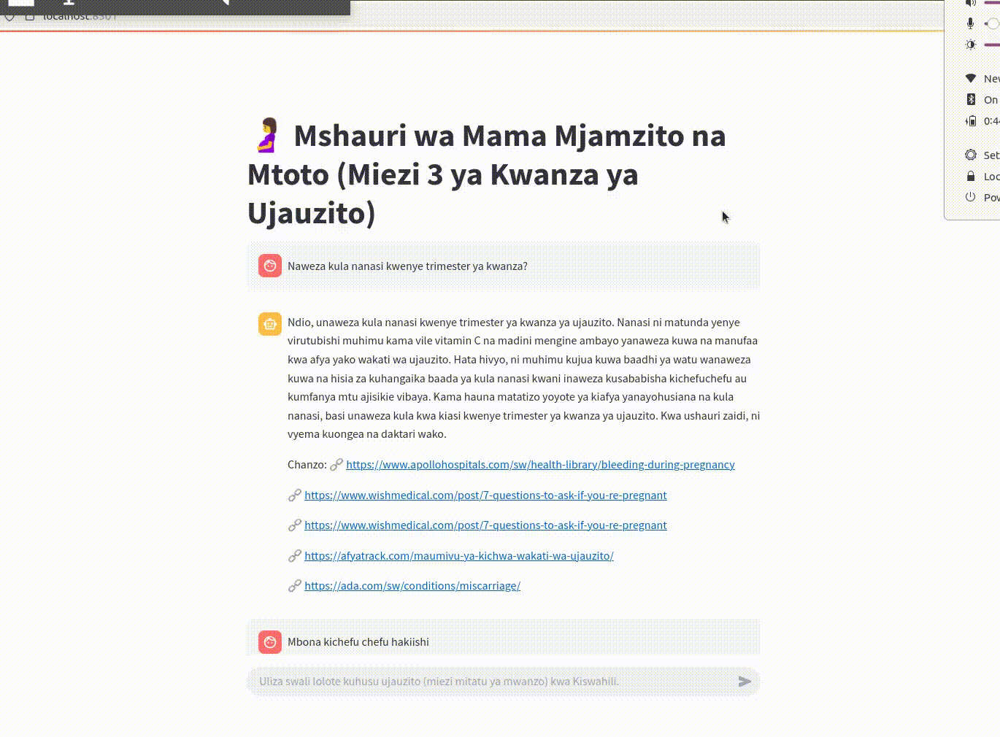

# 🤖 🤰 Mshauri wa Mama Mjamzito na Mtoto (Miezi 3 ya Kwanza ya Ujauzito)

This is a Retrieval-Augmented Generation (RAG) chatbot that answers Swahili questions about the first trimester of pregnancy using a local vector store and OpenAI GPT-3.

[](.)

## 💡 Features

- Swahili support using multilingual embeddings
- Local FAISS vector store for fast retrieval
- Streamlit interface for chatting
- TODO: Expand to other trimesters & more topics

## 🚀 To Run

```bash
pip install -r requirements.txt
python rag/embed_content.py      # One-time setup
streamlit run app/streamlit_app.py
```
